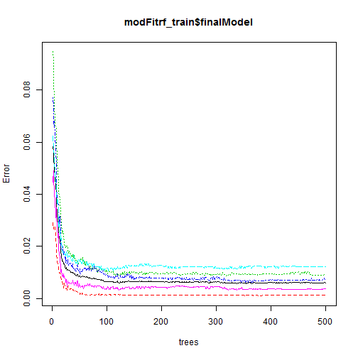

Practical Machine Learning - Project
========================================================
The data for this project come from this source: http://groupware.les.inf.puc-rio.br/har. If you use the document you create for this class for any purpose please cite them as they have been very generous in allowing their data to be used for this kind of assignment. 

What you should submit

The goal of your project is to predict the manner in which they did the exercise. This is the "classe" variable in the training set. You may use any of the other variables to predict with. You should create a report describing how you built your model, how you used cross validation, what you think the expected out of sample error is, and why you made the choices you did. You will also use your prediction model to predict 20 different test cases. 

1. Your submission should consist of a link to a Github repo with your R markdown and compiled HTML file describing your analysis. Please constrain the text of the writeup to < 2000 words and the number of figures to be less than 5. It will make it easier for the graders if you submit a repo with a gh-pages branch so the HTML page can be viewed online (and you always want to make it easy on graders :-).
2. You should also apply your machine learning algorithm to the 20 test cases available in the test data above. Please submit your predictions in appropriate format to the programming assignment for automated grading. See the programming assignment for additional details. 

### Download file 


```r
if(!file.exists("./data")){dir.create("./data")}
fileUrl <- "http://d396qusza40orc.cloudfront.net/predmachlearn/pml-training.csv"
download.file(fileUrl, destfile="./data/pml-training.csv")
fileUrl <- "http://d396qusza40orc.cloudfront.net/predmachlearn/pml-testing.csv"
download.file(fileUrl, destfile="./data/pml-testing.csv")
```
### Load data into R.
The directory data in the working spoace is created, if it not exists:


```r
set.seed(975)
pmltraining <- read.table("./data/pml-training.csv", sep = ",", header=T, stringsAsFactors=F)
pmltesting <- read.table("./data/pml-testing.csv", sep = ",", header=T, stringsAsFactors=F)
```

### Cleanig the dataset:

In order to identify the columns really needed, was used used the documentats from the [Human Activity Recognition Project](http://groupware.les.inf.puc-rio.br/har)

#### All credits to: 
#### Velloso, E.; Bulling, A.; Gellersen, H.; Ugulino, W.; Fuks, H. Qualitative Activity Recognition of Weight Lifting Exercises. Proceedings of 4th International Conference in Cooperation with SIGCHI (Augmented Human '13) . Stuttgart, Germany: ACM SIGCHI, 2013. [Document](http://groupware.les.inf.puc-rio.br/public/papers/2013.Velloso.QAR-WLE.pdf)

The strategy chosen is to remove any variable not directly correlated to the capturing of movement by sensor, and so I delete the first 7 columns:

1. Index 
2. user_name	
3. raw_timestamp_part_1	
4. raw_timestamp_part_2	
5. cvtd_timestamp	
6. new_window	
7. num_window


```r
pmltraining <- pmltraining[,8:ncol(pmltraining)] 
pmltesting <- pmltesting[,8:ncol(pmltesting)] 
```

### The second step to cleaning the dataset id to remove the column with NA values:


```r
pmltraining <- pmltraining[,colSums(is.na(pmltraining)) == 0]
pmltesting <- pmltesting[,colSums(is.na(pmltesting)) == 0]
```

### The third step is to remove the columns with character type values, not needed for the model fitting.

#### Checking char columns and removing except "classe" from dataset pmltraining. The final dataset is made by 52 numeric columns and the classe character column.

```r
ch <- sapply(names(pmltraining), function(x) inherits(pmltraining[,x], c("character")))
ch <- names(which(ch==TRUE))
ch <- ch[!ch == "classe"] 
pmltraining <- pmltraining[,-which(names(pmltraining) %in% ch)]
```

Making classe as factor in order to use it as a outcome variable in the model:

```r
pmltraining$classe <- as.factor(pmltraining$classe)
```

### Building training model.

#### We choose to train the model using Random Forest Algorithm to target a high level of  accuracy. The train control method chosen is oob (Out of Bag). this method perform a high prediction power, and really good performance in computing the model.

According to the [oob document](http://www.stat.berkeley.edu/~breiman/RandomForests/cc_home.htm#ooberr) , this method performs an unbiased estimate internally, so there is no need for cross-validation or a separate test set to get an unbiased estimate.

Anyway, we choose to create the training and test set, in order to renforce the reliable of the result, and demonstrate the application of consepts.

#### Making a train set and a  test set from the pmltraining data set  to validate expected out of sample error, and accuracy.


```r
library(caret)
```

```
## Loading required package: lattice
## Loading required package: ggplot2
```

```r
dp <- createDataPartition(y = pmltraining$classe, p=0.2,list=FALSE) 
dpdatatest <- pmltraining[dp,]
dpdatatrain <- pmltraining[-dp,]
nrow(dpdatatest); nrow(dpdatatrain)
```

```
## [1] 3927
```

```
## [1] 15695
```

#### Training the predictor model:


```r
modFitrf_train <- train(classe ~ ., data = dpdatatrain, method="rf", trControl = trainControl(method = "oob", number = 4)) 
```

```
## Loading required package: randomForest
## randomForest 4.6-7
## Type rfNews() to see new features/changes/bug fixes.
```
#### Plotting the final model:

```r
plot(modFitrf_train$finalModel)
```

 


#### Checking and validating the model using confusionMatrix and postResample method. 


```r
cm <- confusionMatrix(dpdatatest$classe, predict(modFitrf_train, dpdatatest))
cm
```

```
## Confusion Matrix and Statistics
## 
##           Reference
## Prediction    A    B    C    D    E
##          A 1115    1    0    0    0
##          B    4  756    0    0    0
##          C    0    3  676    6    0
##          D    0    0    0  644    0
##          E    0    0    0    0  722
## 
## Overall Statistics
##                                         
##                Accuracy : 0.996         
##                  95% CI : (0.994, 0.998)
##     No Information Rate : 0.285         
##     P-Value [Acc > NIR] : <2e-16        
##                                         
##                   Kappa : 0.995         
##  Mcnemar's Test P-Value : NA            
## 
## Statistics by Class:
## 
##                      Class: A Class: B Class: C Class: D Class: E
## Sensitivity             0.996    0.995    1.000    0.991    1.000
## Specificity             1.000    0.999    0.997    1.000    1.000
## Pos Pred Value          0.999    0.995    0.987    1.000    1.000
## Neg Pred Value          0.999    0.999    1.000    0.998    1.000
## Prevalence              0.285    0.194    0.172    0.166    0.184
## Detection Rate          0.284    0.193    0.172    0.164    0.184
## Detection Prevalence    0.284    0.194    0.174    0.164    0.184
## Balanced Accuracy       0.998    0.997    0.999    0.995    1.000
```

```r
pr <- postResample(predict(modFitrf_train, dpdatatest), dpdatatest$classe)
pr
```

```
## Accuracy    Kappa 
##   0.9964   0.9955
```

### We observe an accuracy of 0.996, and an estimate of OOB error rate of 0.6% as follow:


```r
modFitrf_train$finalModel
```

```
## 
## Call:
##  randomForest(x = x, y = y, mtry = param$mtry) 
##                Type of random forest: classification
##                      Number of trees: 500
## No. of variables tried at each split: 27
## 
##         OOB estimate of  error rate: 0.6%
## Confusion matrix:
##      A    B    C    D    E class.error
## A 4459    3    1    0    1    0.001120
## B   19 3010    8    0    0    0.008890
## C    0   16 2717    4    0    0.007307
## D    0    1   27 2541    3    0.012053
## E    0    1    3    7 2874    0.003813
```


###  Predicting values for pml-testing 

#### Make prediction

```r
pred <- predict(modFitrf_train, pmltesting)
```

#### Submitting function ( 20/20 correct).


```r
pml_write_files = function(x){
  n = length(x)
  for(i in 1:n){
    filename = paste0("problem_id_",i,".txt")
    write.table(x[i],file=filename,quote=FALSE,row.names=FALSE,col.names=FALSE)
  }
}
pml_write_files(pred)
```

